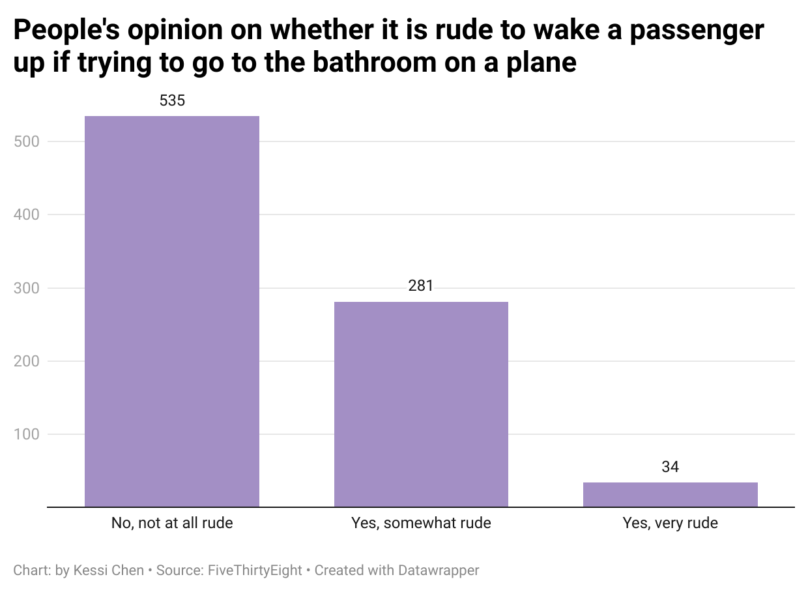

# JOURN 124_Flying Etiquette Excercise & Datawrapper_Kessi Chen

## Datawrapper graph

## Chart Explanation

> I chose to explore the question "Is it rude to wake a passenger up if trying to go to the bathroom on a plane?" because, as a frequent traveler who prefers the window seat, this is something I genuinely wonder about. Often, I feel a bit guilty about waking someone up if I need to get up, even though I usually manage to avoid it during most flights.
> The chart shows the results of a survey on this topic, revealing a variety of opinions. The majority of people, 535 respondents, believe that it is not rude at all to wake someone up to use the bathroom. This reassures me that most people understand the necessity and don't mind being disturbed. Another 281 people consider it somewhat rude, indicating that they might feel slightly inconvenienced but probably understand the need. Surprisingly, 34 people think it's very rude to wake someone up for this reason, which is more than I expected. This data helps me feel a bit better about my own actions, knowing that most people don't view it as a significant issue.
